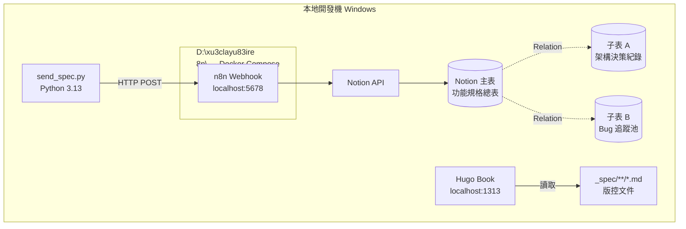

# Phase 1 — 本地基礎設施與 Notion 資料庫建置：設計文件

> 閱讀對象：SA、Backend、DevOps
> 產出工具：/addyosmani-saspec

---

## 技術架構



---

## 目錄結構

```
D:\06_Workspace\Workspace_GitHub\xu3clayu83ire\
├── n8n\                              ← 共用 n8n 容器設定
│   ├── docker-compose.yml
│   └── .env                          ← WORKSPACE_ROOT、n8n 帳密（不版控）
├── awtw-short-url-service\           ← 本專案
│   ├── _spec\
│   │   └── phase1-infrastructure\
│   ├── _note\
│   ├── send_spec.py                  ← 推送規格腳本
│   └── hugo-docs\                    ← Hugo Book 站台
│       ├── config.toml
│       └── content\
└── <其他專案>\
```

---

## 模組拆解

| 模組 | 職責 | 負責角色 |
|------|------|---------|
| `n8n/docker-compose.yml` | 啟動 n8n 容器，Volume Mount 工作區根目錄至 `/data/projects` | DevOps |
| `n8n/.env` | 存放 `WORKSPACE_ROOT`、n8n 帳密，不版控 | DevOps |
| `hugo-docs/config.toml` | Hugo Book 主題設定、站台名稱、目錄結構 | DevOps |
| Notion DB 規範文件 | 三張資料庫欄位定義、型態、Relation 設定說明（人工操作指引） | Backend |
| `send_spec.py` | 讀取本地 Markdown → 組裝 JSON → POST 到 n8n Webhook，含冪等檢查 | Backend |
| 環境驗證 Checklist | 逐項確認各服務正常，作為 Phase 2 前置條件的 gate | QA |

---

## 資料模型

### Notion 主表【功能規格總表】

```typescript
interface NotionSpecRecord {
  Name: string;           // Title  — 功能名稱，例：「【規格】個人縮網址服務」
  Status: 'Draft' | 'Ready to Plan' | 'In Dev' | 'Done';
  Slug: string;           // Text   — Hugo 檔名與網址，例：short-url-service
  Weight: number;         // Number — Hugo 左側選單排序，數字越小越靠上
  Tasks_To_Open: string;  // Text   — 每行一張 Jira 票描述，供 n8n 讀取
  Jira_Epic_Key: string;  // Text   — n8n 開票後回填
  Spec_URL: string;       // URL    — GitLab 上 spec.md 的連結
  Deploy_URL: string;     // URL    — CloudFront 部署後的文件站網址
}
```

### Notion 子表 A【架構決策紀錄】

```typescript
interface NotionADRRecord {
  Name: string;           // Title    — 決策標題
  RelatedSpec: Relation;  // Relation → 主表（雙向）
  Decision: string;       // Text     — 決定內容
  Options: string;        // Text     — 比較的選項
  Date: string;           // Date     — 決策日期
}
```

### Notion 子表 B【Bug 追蹤池】

```typescript
interface NotionBugRecord {
  Name: string;           // Title    — Bug 標題
  RelatedSpec: Relation;  // Relation → 主表（雙向）
  Status: 'Open' | 'In Progress' | 'Resolved';
  Severity: 'Critical' | 'High' | 'Medium' | 'Low';
  Description: string;    // Text     — 重現步驟與影響範圍
}
```

---

## API 契約

### send_spec.py → n8n Webhook

**呼叫方式**
```powershell
py send_spec.py "<功能名稱>" "<slug>" <weight> "<spec_md_路徑>"
# 範例：
py send_spec.py "個人縮網址服務" "short-url-service" 10 "_spec/phase1-infrastructure/spec.md"
```

**POST Payload（send_spec.py 組裝）**
```json
{
  "name": "【規格】個人縮網址服務",
  "slug": "short-url-service",
  "weight": 10,
  "content": "<spec.md 全文內容>"
}
```

**冪等檢查流程**
1. POST 前先呼叫 Notion Query API，過濾 `Slug == <slug>`
2. 若已有資料 → 輸出「已存在，跳過」，exit 0
3. 若無資料 → 執行 POST 到 n8n Webhook

**回應處理**
- HTTP 200 → 輸出成功訊息，exit 0
- 非 200 → 輸出錯誤訊息與狀態碼，exit 1

---

## docker-compose.yml 規格

```yaml
services:
  n8n:
    image: docker.n8n.io/n8nio/n8n:latest
    ports:
      - "5678:5678"
    environment:
      - N8N_BASIC_AUTH_ACTIVE=true
      - N8N_BASIC_AUTH_USER=${N8N_USER}
      - N8N_BASIC_AUTH_PASSWORD=${N8N_PASSWORD}
    volumes:
      - n8n_data:/home/node/.n8n
      - ${WORKSPACE_ROOT}:/data/projects

volumes:
  n8n_data:
```

`.env` 範本（不版控）：
```
WORKSPACE_ROOT=D:\06_Workspace\Workspace_GitHub\xu3clayu83ire
N8N_USER=admin
N8N_PASSWORD=<自行設定>
```

---

## 技術決策

| 決策項目 | 選擇 | 理由 | 備選方案 |
|---------|------|------|---------|
| n8n 部署位置 | `xu3clayu83ire\n8n\`（工作區層級，共用） | 多專案共用一個引擎，避免 port 衝突與資源浪費 | 每個專案獨立（被排除，資源浪費） |
| n8n 執行方式 | Docker Compose 本地容器 | 程式碼不送外部服務，符合安全需求 | n8n Cloud（被排除，程式碼會上傳） |
| send_spec 語言 | Python 3.13（`py` 指令） | 本機已安裝，`requests` 函式庫處理 HTTP 簡潔 | Bash（Windows 相容性差）、PowerShell（較冗長） |
| Hugo 主題 | hugo-book（Git Submodule） | 適合技術文件，左側目錄結構清晰 | Docsy（過重）、自製主題（耗時） |
| Notion 連線方式 | Internal Integration Token | 個人使用，不需要 OAuth 複雜度 | OAuth 2.0（過度設計） |

---

## 已知風險與對策

| 風險 | 機率 | 對策 |
|------|------|------|
| Notion API Token 外洩 | 中 | 寫入 `.env`，加入 `.gitignore` |
| send_spec.py 重複推送建立重複資料 | 高 | 執行前先查詢 Notion Slug，有則跳過 |
| Windows 路徑在 Docker Volume Mount 格式問題 | 中 | 使用 `${WORKSPACE_ROOT}` 變數，測試時確認 Docker Desktop 已開啟 File Sharing |
| Hugo submodule 版本漂移 | 低 | 鎖定 commit hash，不用 `latest` |
| n8n 容器重啟後 Workflow 設定遺失 | 低 | `n8n_data` volume 持久化，不使用 bind mount 存設定 |
