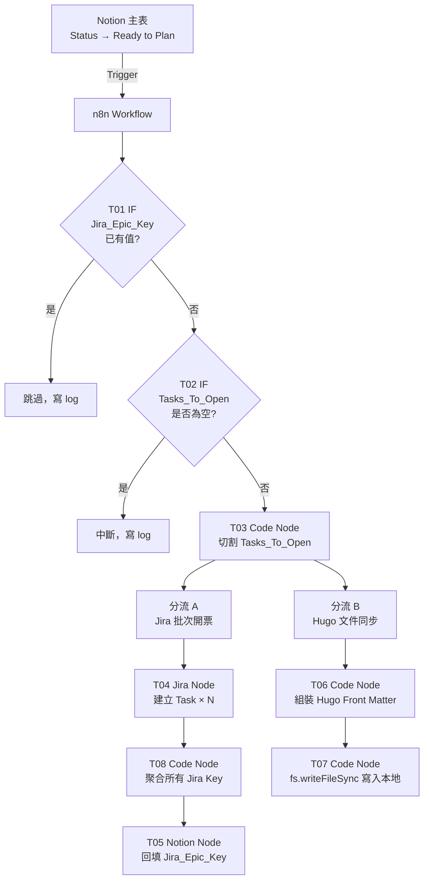

# Phase 2 — n8n 自動化分流管線：設計文件

> 閱讀對象：SA、Backend、DevOps
> 產出工具：/addyosmani-saspec
> 前置條件：Phase 1 全部完成

---

## 技術架構



---

## n8n 節點清單

| 順序 | 節點名稱 | 型態 | 說明 |
|------|---------|------|------|
| 1 | Notion Trigger | Notion Trigger | Poll 模式，每分鐘檢查一次 |
| 2 | T01 IF | IF | `Jira_Epic_Key` 為空才繼續 |
| 3 | T02 IF | IF | `Tasks_To_Open` 不為空才繼續 |
| 4 | T03 Cut Task | Code（JS） | 依換行符切割，產出任務陣列 |
| 5A | T04 Jira Create an issue | Jira Software（迴圈） | 每個任務建一張票 |
| 6A | T08 Combine Jira Key | Code（JS） | 聚合所有票號為逗號分隔字串 |
| 7A | T05 Update Notion | Notion | 更新主表 `Jira_Epic_Key`（含所有票號） |
| 5B | T06 Hugo Front Matter | Code（JS） | 產出 Hugo Markdown 內容 |
| 6B | T07 Hugo docs | Code（JS）+ `fs` | 以 `fs.writeFileSync` 寫入本地掛載路徑 |

---

## Tasks_To_Open 格式規範

每行格式：`[類型] 任務標題｜TDD: 測試命名`

```
[Backend] 實作 POST /api/shorten｜TDD: 應該_成功產生短網址_當輸入合法URL時
[Backend] 實作 GET /:code 轉址｜TDD: 應該_成功轉址_當短碼存在時
[DevOps] 建立 DynamoDB Table schema｜TDD: 應該_成功寫入並讀取資料_當Schema正確時
```

切割邏輯（T03 Cut Task，Run Once for All Items）：
```javascript
const item = $input.first().json;
const raw = item.Tasks_To_Open ?? '';
const lines = raw.split('\n').map(l => l.trim()).filter(l => l.length > 0);

return lines.map(line => {
  const [left, right] = line.split('｜TDD:');
  const roleMatch = left ? left.match(/^\[(.+?)\]/) : null;
  return {
    json: {
      role: roleMatch ? roleMatch[1] : 'Backend',
      title: left ? left.replace(/^\[.+?\]\s*/, '').trim() : '',
      tdd: right ? right.trim() : '',
      notionPageId: item.id ?? '',
      notionPageUrl: '',
      specUrl: item.Spec_URL ?? '',
      slug: item.Slug ?? '',
    }
  };
});
```

> 注意：n8n Notion Trigger 回傳簡化格式，屬性直接以 `$json.屬性名稱` 存取，無需透過 `.properties.X.rich_text`

---

## Jira 票面自動組裝格式

```
## 任務說明
{{title}}

## TDD 完成定義 (DoD)
- [ ] 測試命名：`{{tdd}}`
- [ ] 🔴 紅燈：測試必須先 Fail，截圖或終端機輸出為憑
- [ ] 🟢 綠燈：實作後測試 Pass，覆蓋率 100%
- [ ] 🔵 藍燈：重構完成，git commit 已執行

## 規格來源
- Notion：{{notionPageUrl}}
- Spec：{{specUrl}}
```

Jira 節點設定：
- **Host**：`https://prostyliu.atlassian.net`
- **Project**：`awtw-short-url-service`（ID: 10000）
- **Issue Type**：`任務`（ID: 10003）
- **執行模式**：`Run Once for Each Item`

---

## Jira Key 聚合邏輯

T08 Combine Jira Key（Run Once for All Items）：
```javascript
const items = $input.all();
const allKeys = items.map(item => item.json.key).join(', ');
const notionPageId = $('Notion Trigger').first().json.id;

return [{ json: { allKeys, notionPageId } }];
```

一筆 Notion 功能可對應多張 Jira 票，`Jira_Epic_Key` 儲存所有票號（如 `ASUS-8, ASUS-9`），同時作為冪等判斷依據。

---

## Hugo Front Matter 組裝格式

T06 Hugo Front Matter（Run Once for All Items）：
```javascript
const item = $input.first().json;
const title = item.Name ?? '';
const slug = item.Slug ?? '';
const weight = item.Weight ?? 99;
const body = item.Tasks_To_Open ?? '';

const content = `---
title: "${title}"
weight: ${weight}
---

${body}
`;

return [{ json: { slug, content } }];
```

T07 Hugo docs（寫檔，Run Once for All Items）：
```javascript
const fs = require('fs');
const item = $input.first().json;

const filePath = `/data/projects/alag-addyosmani-demos/awtw-short-url-service/hugo-docs/content/docs/${item.slug}.md`;

fs.writeFileSync(filePath, item.content, 'utf8');

return [{ json: { success: true, filePath } }];
```

容器內路徑對應關係：
| 容器內路徑 | Windows 路徑 |
|-----------|-------------|
| `/data/projects/` | `D:\06_Workspace\Workspace_GitHub\xu3clayu83ire\` |
| `/data/projects/alag-addyosmani-demos/awtw-short-url-service/` | `...\alag-addyosmani-demos\awtw-short-url-service\` |

---

## n8n Credential 設定清單

| Credential | 型態 | 需要的值 |
|-----------|------|---------|
| Notion API | Notion API | Internal Integration Token |
| Jira API | Jira Software Cloud | Email + API Token |

取得 Jira API Token：
1. 開啟 `https://id.atlassian.com/manage-profile/security/api-tokens`
2. 點「Create API token」
3. 複製 Token，填入 n8n Jira Credential

---

## docker-compose.yml 必要設定

```yaml
services:
  n8n:
    image: docker.n8n.io/n8nio/n8n:latest
    restart: unless-stopped
    user: "0:0"
    environment:
      - NODE_FUNCTION_ALLOW_BUILTIN=fs
    volumes:
      - n8n_data:/root/.n8n
      - ${WORKSPACE_ROOT}:/data/projects
```

| 設定項目 | 值 | 原因 |
|---------|-----|------|
| `user: "0:0"` | root 執行 | 允許寫入 Windows 掛載目錄 |
| `NODE_FUNCTION_ALLOW_BUILTIN=fs` | 啟用 fs 模組 | Code 節點使用 `require('fs')` |
| volume: `/root/.n8n` | root home 目錄 | 對應 `user: "0:0"` 的 home 路徑 |

---

## 技術決策

| 決策項目 | 選擇 | 理由 | 備選方案 |
|---------|------|------|---------|
| Notion Trigger 模式 | Poll（每分鐘） | n8n Free 版不支援 Notion Webhook | Webhook（需付費方案） |
| Jira 連線方式 | n8n 內建 Jira Software node | 官方支援，不需自行處理 OAuth | HTTP Request 自組（過度複雜） |
| 冪等判斷欄位 | `Jira_Epic_Key` 是否有值 | 簡單可靠，開票後即回填 | 另建狀態欄位（過度設計） |
| Jira_Epic_Key 內容 | 所有票號逗號分隔 | 一筆功能可有多張票，提升可追溯性 | 只存第一筆（無法看全） |
| 任務切割語言 | n8n Code Node（JavaScript） | n8n 原生支援，無需安裝依賴 | Python（n8n 不原生支援） |
| Hugo 文件寫入 | Code Node + `fs.writeFileSync` | Write Binary File 對 Docker 掛載目錄有寫入限制 | Write Binary File（有權限問題） |

---

## 已知風險與對策

| 風險 | 機率 | 對策 |
|------|------|------|
| Notion Poll 最快每分鐘觸發一次，有延遲 | 高（設計限制） | 接受，非即時需求可容忍 |
| Tasks_To_Open 格式錯誤導致切割失敗 | 中 | Code Node 加防禦性解析，格式錯誤的行跳過並 log |
| Jira API Rate Limit（免費版每 10 秒 50 次） | 低 | 每張票建立間隔無需刻意控制，批次量少 |
| Write File 路徑不存在導致寫入失敗 | 低 | 確認 hugo-docs/content/docs/ 目錄已存在（Phase 1 已建） |
| n8n 容器重啟後 Workflow 遺失 | 低 | Workflow JSON 版控於 Git，可隨時匯入還原 |
| n8n 以 root 執行帶來安全風險 | 低（本地開發） | 僅限本地環境，正式環境需改用適當 uid/gid 並設定目錄權限 |
