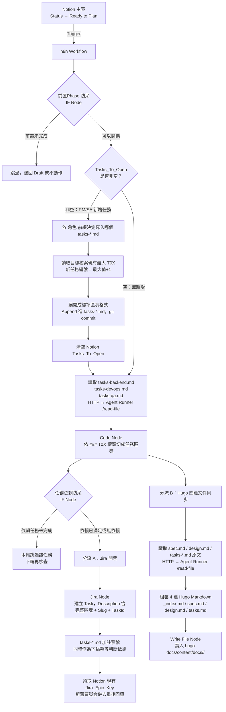

# Phase 2 — n8n 自動化分流管線：設計文件

> 閱讀對象：SA、Backend、DevOps
> 產出工具：/addyosmani-saspec
> 前置條件：Phase 1 全部完成

---

> **2026-07-05 修訂**：原設計以 Notion `Tasks_To_Open`（精簡一行格式）作為開票與 Hugo 同步的唯一來源，實測後發現兩個問題：
> 1. Jira 票開出去之後跟 `tasks-*.md` 完全斷連，`tasks-*.md` 的 ⬜/✅ 與依賴關係無法反映在票上
> 2. Hugo 文件站只有任務清單，沒有 SA 規格、設計文件、開發文件可看
>
> 本次修訂把 `tasks-*.md` 提升為開票的**直接來源**（而非透過 Notion 精簡格式間接轉譯），並讓 Jira 票與 `tasks-*.md` 維持雙向連結；Hugo 文件站改為每個 phase 同步四篇文件。決策記錄見 `_note/decisions.md`。

---

## 技術架構



---

## n8n 節點清單

| 順序 | 節點名稱 | 型態 | 說明 |
|------|---------|------|------|
| 1 | Notion Trigger | Notion Trigger | Poll 模式，每分鐘檢查一次 `Status = Ready to Plan` |
| 2 | 前置Phase Guard | IF | `HasPrevPhase=false` 或 `前置Jira_Epic_Key` 非空才繼續（沿用既有機制，見 `_rule/asus-conventions.md`） |
| 2a | Tasks_To_Open 非空檢查 | IF | 判斷 PM/SA 是否透過 Notion 新增了任務（收件匣機制，見「Notion 新增任務入口」章節） |
| 2b | 格式驗證 | IF | 檢查 `｜TDD:` 分隔符與 `[角色]` 是否為合法值（Backend/DevOps/QA/Frontend） |
| 2b-fail | 留言通知格式錯誤 | Notion Node（create-comment） | 格式不合法時，在 phase 頁面留言原始行內容 + 失敗原因，該行保留在 `Tasks_To_Open` 不清空 |
| 2c | 決定目標檔案 | Code（JS） | 依 `[角色]` 前綴對應到 `tasks-backend.md`／`tasks-devops.md`／`tasks-qa.md` |
| 2d | 計算新任務編號 | HTTP `/read-file` + Code（JS） | 讀目標檔案現有最大 `T0X`，新編號 = 最大值 + 1 |
| 2e | 展開並寫入任務區塊 | Code + HTTP `/write-file` | 組成標準區塊格式，append 進目標檔案，git commit |
| 2f | 更新 Tasks_To_Open | Notion Node（Update） | 只移除已成功轉換的行，失敗的行保留 |
| 3 | 讀取任務檔 | HTTP Request（迴圈） | 對 `tasks-backend.md`／`tasks-devops.md`／`tasks-qa.md` 各呼叫一次 Agent Runner `/read-file`（含剛才 2d 新寫入的任務） |
| 4 | 切割任務區塊 | Code（JS） | 依 `### T0X — .+ [⬜✅]` 標頭切割，只保留 `⬜` 的區塊 |
| 5 | 任務依賴 Guard | IF（迴圈內） | 解析區塊內「依賴：T0X」，檢查依賴任務是否已有 Jira 票號；沒有就跳過本任務 |
| 6A | 建立 Jira Task | Jira Software（迴圈） | 每個通過 Guard 的任務區塊建一張票 |
| 7A | 回填任務票號（tasks-*.md） | Code + HTTP `/write-file` | 把 Jira 票號寫回 `tasks-*.md` 對應任務標題行（附註 `(ASUS-97)`），此標註同時作為下一輪的冪等判斷依據 |
| 8A | 讀取現有 Jira_Epic_Key | Notion Node（Get） | 讀出 Notion 主表目前的 `Jira_Epic_Key` 值，供下一步合併 |
| 9A | 合併並回填 Jira_Epic_Key | Code + Notion Node（Update） | 新舊票號合併去重後寫回，避免增量開票時覆蓋既有紀錄 |
| 6B | 讀取規格三件套 | HTTP Request ×3 | 讀 `spec.md`、`design.md`、當次處理的 `tasks-*.md` 原文 |
| 7B | 組裝 Hugo 四篇 | Code（JS） | 產出 `_index.md`（總覽/連結頁）、`spec.md`、`design.md`、`tasks.md`（四篇皆含 Front Matter） |
| 8B | 寫入四篇文件 | Write Binary File ×4 | 寫到 `hugo-docs/content/docs/<slug>/` 底下 |

---

## 任務區塊格式規範

延續現有 `tasks-*.md` 的任務區塊格式（`/addyosmani-plan` 已經是這樣產出），開票時直接解析，不再另外精簡：

```markdown
### T02 — 實作 GET /{code} ⬜　🤖 AI 執行

**依賴**：T01

在 `handler.ts` 新增轉址邏輯：
- 從 DynamoDB 查詢短碼
- 找到：回傳 HTTP 301，Location header 設為原始 URL
- 找不到：回傳 HTTP 404，`{ "error": "短網址不存在" }`

**完成定義**：
- 測試命名：`應該_回傳301轉址_當短碼存在` / `應該_回傳404_當短碼不存在`
- 🔴 紅燈確認：GET 路由未實作，單元測試 Fail
- 🟢 綠燈確認：`npm run test` 通過，部署後瀏覽器開啟 `<API_URL>/<code>` 正確轉址（AC3、AC4）
```

切割邏輯（Code Node JS，概念示意）：
```javascript
const raw = $json.content; // Agent Runner /read-file 回傳的原始 markdown
const blocks = raw.split(/(?=^### T\d+ )/m).filter(b => b.trim().startsWith('### T'));

return blocks
  .map(block => {
    // 標頭格式：### T02 — 標題 ⬜　🤖 AI 執行　(ASUS-97)　← 票號是選填，開票後才會出現
    const headerMatch = block.match(/^### (T\d+) — (.+?) ([⬜✅])\s*(?:　(.+?))?\s*(?:\((ASUS-\d+(?:,\s*ASUS-\d+)*)\))?$/m);
    if (!headerMatch) return null;
    const [, taskId, title, statusIcon, execMode, existingJiraKeys] = headerMatch;
    const depMatch = block.match(/\*\*依賴\*\*[：:]\s*(T\d+(?:[,、]\s*T\d+)*)/);
    return {
      json: {
        taskId,           // 例如 T02
        title: title.trim(),
        status: statusIcon === '✅' ? 'done' : 'todo',
        alreadyTicketed: Boolean(existingJiraKeys), // 已經開過票，只是還沒完成
        execMode: execMode ? execMode.trim() : '',
        dependsOn: depMatch ? depMatch[1].split(/[,、]\s*/) : [],
        body: block.trim(),
      }
    };
  })
  // 冪等判斷：todo 且尚未開票，才是這輪要開的新任務
  .filter(item => item && item.json.status === 'todo' && !item.json.alreadyTicketed);
```

**冪等判斷（2026-07-05 修訂，支援增量新增任務）**：一個任務區塊有三種狀態，缺一不可：

| 狀態 | 標頭範例 | 這輪要不要開票 |
|------|---------|--------------|
| 尚未開票 | `### T10 — 標題 ⬜　🤖 AI 執行` | ✅ 要開 |
| 已開票、尚未完成 | `### T02 — 標題 ⬜　🤖 AI 執行　(ASUS-97)` | ❌ 跳過（避免重複開票） |
| 已完成 | `### T01 — 標題 ✅　🤖 AI 執行　(ASUS-88)` | ❌ 跳過 |

只看 ⬜/✅ 不夠，必須同時看有沒有票號標註，否則「已開票但工作還沒做完」的任務會在每輪排程被重複開票。這代表在 `tasks-*.md` 已經開票的 phase 裡新增一個 `⬜` 區塊（不帶票號），下一輪排程就會被偵測到並自動開新票——支援增量新增任務，不需要為了一個新功能另開一個 phase。

---

## 任務依賴防呆邏輯

同一份 `tasks-*.md` 內部的任務可能互相依賴（例如 Phase5 的 T02 依賴 T01）。開票前檢查：

```javascript
// item.dependsOn 例如 ['T01']
// allTasksInFile 是同一份檔案切出來的全部任務區塊（含已完成的）
const blocked = item.dependsOn.some(depId => {
  const dep = allTasksInFile.find(t => t.taskId === depId);
  return !dep || dep.status !== 'done'; // 找不到或未完成都視為阻塞
});

if (blocked) {
  // 本輪跳過，不開票；下一輪排程再重新檢查
  return [];
}
```

**判斷「已完成」的依據**：`tasks-*.md` 該任務的圖示是 `✅`（由 Phase 3 的回寫機制維護，見 `_spec/phase3-ai-agent/design.md`）。

---

## Notion 新增任務入口（PM/SA 用，2026-07-05 新增）

**問題**：`tasks-*.md` 是 git 版控檔案，只有工程師會直接編輯。PM/SA 等非工程角色平常操作 Notion，需要一個不用碰 git 的新增任務入口，同時不能讓 Notion 變成跟 `tasks-*.md` 平行、可能分歧的第二個真相來源。

**設計**：把 `Tasks_To_Open` 重新定位成**收件匣**，而不是持久記錄：

1. PM/SA 在 Notion `Tasks_To_Open` 用簡化格式新增一行（沿用舊的「Notion 開票格式」語法，PM/SA 不需要寫完整區塊）：
   ```
   [Backend][AI] 任務標題｜TDD: 測試命名｜依賴: T03
   ```
   （`｜依賴: T0X` 為選填）
2. n8n 每輪排程檢查 `Tasks_To_Open` 是否非空。非空時，對每一行：
   - 依 `[角色]` 決定要寫入哪個檔案：`Backend → tasks-backend.md`、`DevOps → tasks-devops.md`、`QA → tasks-qa.md`
   - 讀取該檔案，找出目前最大的 `T0X` 編號，新任務編號 = 最大值 + 1
   - 展開成標準區塊格式：
     ```markdown
     ### T06 — 任務標題 ⬜　🤖 AI 執行

     **依賴**：T03

     > 由 Notion 新增，詳細任務描述待補充

     **完成定義**：
     - 測試命名：`測試命名`
     ```
   - Append 進對應檔案，`git commit`（訊息：`docs(tasks): Notion 新增 <slug> T0X`）
3. 轉換完成後，**清空 Notion 的 `Tasks_To_Open`**（不是保留），代表這一批已經被消化、寫入 `tasks-*.md` 了。下次 PM/SA 要再新增，就再填一次。
4. 清空之後，這個新任務就跟其他任務走一樣的路：下一輪「切割任務區塊」會讀到它，走正常的依賴防呆與開票流程。

**這樣設計的效果**：`tasks-*.md` 永遠是唯一持久的真相來源；Notion `Tasks_To_Open` 只是暫存的輸入信箱，不會跟 `tasks-*.md` 分歧，因為它處理完就清空，不會有兩份長期並存、可能對不上的任務清單。

**已知限制**：PM/SA 寫的簡化格式沒有「完整任務描述」，只有標題和 TDD 命名，展開後的區塊會是精簡版（跟 `/addyosmani-plan` 產出的完整版比起來資訊量較少）。如果 PM/SA 需要補充更多細節，仍然要請工程師事後編輯 `tasks-*.md` 該區塊——但至少任務已經存在、有編號、能被追蹤，不會漏掉。

**格式錯誤回饋管道（2026-07-05 新增）**：PM/SA 送出的格式不符規範時（缺 `｜`、角色前綴打錯字等），不能默默失敗，需要讓提交者知道。做法：

- 解析失敗時，n8n 呼叫 Notion `create-comment` API，在該 phase 頁面留言，內容包含：
  - 原始輸入的那一行文字（方便對照）
  - 解析失敗的原因（例如「找不到 `｜TDD:` 分隔符」「角色 `[Bankend]` 不是合法選項（Backend/DevOps/QA/Frontend）」）
  - 提示：「請修正格式後重新填入 Tasks_To_Open」
- `Tasks_To_Open` 該行**不清空**，留在欄位裡等待修正重新送出（跟成功轉換後的清空行為不同，藉此讓 PM/SA 知道這行還「卡著」）
- 若同一批次裡有的行成功、有的行失敗：成功的正常轉換並從 `Tasks_To_Open` 移除，失敗的保留在 `Tasks_To_Open` 裡（欄位內容改寫成只剩失敗的行），成功與失敗分開處理，不要因為一行錯誤就整批卡住

---

## Jira 票面自動組裝格式

```
## 任務說明
{{title}}

## 完整任務內容
{{body}}

## 規格來源
- Notion：{{notionPageUrl}}
- Slug：{{slug}}
- TaskId：{{slug}}#{{taskId}}
- ExecMode：{{execMode}}
```

> **2026-07-05 修正**：初版忘記把任務的執行方式（AI／手動）放進票面任何位置，導致 `asus-dev-workflow` 判斷「是否為手動票、要不要跳過」的邏輯失效（舊邏輯檢查 `summary` 是否含 `[手動]`，但新版標題已經不含這個字樣）。修正後新增 `ExecMode：AI` 或 `ExecMode：手動` 這行，`asus-dev-workflow` 改成解析這行來判斷是否略過。

`{{body}}` 為切割出來的**完整任務區塊原文**（含依賴、完成定義所有項目），不再只塞 TDD 測試命名一行。`TaskId` 是 Phase 3 回寫 `tasks-*.md` 時定位用的關鍵欄位，格式固定為 `<slug>#<taskId>`（例如 `phase4-cicd-review#T02`）。

Jira 節點設定：
- **Host**：`https://prostyliu.atlassian.net`
- **Project**：`ASUS`
- **Issue Type**：`Task`
- **執行模式**：`Run Once for Each Item`

---

## 回填任務票號（tasks-*.md 側）

開票成功後，把票號寫回 `tasks-*.md` 該任務的標題行——這個標註**同時是人工參照，也是冪等判斷的依據**（見上一節）：

```
### T02 — 實作 GET /{code} ⬜　🤖 AI 執行　(ASUS-97)
```

透過 Agent Runner `/write-file`（或未來新增 `/patch-file` 端點做局部取代）完成，寫入後 `git add` + `git commit`（commit message：`docs(tasks): 回填 <slug> T0X 票號 <jira-key>`）。

**Notion `Jira_Epic_Key` 改成 append，不是覆蓋（2026-07-05 修訂）**：原邏輯是把這次新建的票號直接寫入 `Jira_Epic_Key`（`T11 Update Notion Jira Key` 節點），如果 phase 已經開過票、之後又增量新增任務再開新票，會**覆蓋掉先前紀錄的票號**。改成：

```javascript
// 寫入前先讀出 Notion 現有的 Jira_Epic_Key
const existing = $json.existingJiraEpicKey ?? ''; // 從 Notion Get 節點取得
const newKeys = items.map(item => item.json.key); // 這次新建的票號
const merged = [existing, ...newKeys]
  .filter(Boolean)
  .flatMap(s => s.split(',').map(k => k.trim()))
  .filter((k, i, arr) => arr.indexOf(k) === i) // 去重
  .join(', ');

return [{ json: { allKeys: merged } }];
```

寫入 Notion 前需要先加一個「讀取現有 `Jira_Epic_Key`」節點，取得 `existingJiraEpicKey` 供合併使用。

---

## Hugo 四篇文件同步格式

每個 phase 在 `hugo-docs/content/docs/<slug>/` 底下產出：

| 檔案 | 內容來源 | 說明 |
|------|---------|------|
| `_index.md` | Notion 屬性（Name/Weight）+ 組裝 | 總覽頁，列出下方三篇的連結與 phase 狀態 |
| `spec.md` | `_spec/<slug>/spec.md` 原文 | 直接同步，加 Front Matter |
| `design.md` | `_spec/<slug>/design.md` 原文 | 直接同步，加 Front Matter |
| `tasks.md` | `_spec/<slug>/tasks-*.md` 原文（合併 backend/devops/qa） | 保留 ⬜/✅ 狀態，公開瀏覽開發進度 |

Front Matter 組裝範例（`spec.md` 為例）：
```javascript
const content = `---
title: "${title} — 規格文件"
weight: ${weight}
---

${specMdContent}
`;
```

Write File 節點寫入路徑：
```
hugo-docs/content/docs/{{slug}}/_index.md
hugo-docs/content/docs/{{slug}}/spec.md
hugo-docs/content/docs/{{slug}}/design.md
hugo-docs/content/docs/{{slug}}/tasks.md
```

> 取代原本的 `hugo-docs/content/docs/{{slug}}.md` 單檔格式，改用資料夾方式讓每個 phase 有獨立的文件群組（Hugo Book 主題原生支援巢狀目錄）。

---

## n8n Credential 設定清單

| Credential | 型態 | 需要的值 |
|-----------|------|---------|
| Notion API | Notion API | Internal Integration Token |
| Jira API | Jira API | Email + API Token（從 Atlassian 帳號設定取得） |

取得 Jira API Token：
1. 開啟 `https://id.atlassian.com/manage-profile/security/api-tokens`
2. 點「Create API token」
3. 複製 Token，填入 n8n Jira Credential

---

## 技術決策

| 決策項目 | 選擇 | 理由 | 備選方案 |
|---------|------|------|---------|
| Notion Trigger 模式 | Poll（每分鐘） | n8n Free 版不支援 Notion Webhook | Webhook（需付費方案） |
| Jira 連線方式 | n8n 內建 Jira Software node | 官方支援，不需自行處理 OAuth | HTTP Request 自組（過度複雜） |
| 開票來源（2026-07-05 修訂） | 直接讀 `tasks-*.md` 原文切割 | `Tasks_To_Open` 精簡格式會遺失依賴與完整驗收標準，且開票後跟來源斷連 | 維持 `Tasks_To_Open`（已證實資訊不足） |
| 冪等判斷欄位（2026-07-05 修訂） | `tasks-*.md` 任務區塊的 ⬜/✅ | 單一事實來源，跟 Phase 3 回寫機制天然一致 | `Jira_Epic_Key` 是否有值（無法反映任務層級狀態） |
| Slug 傳遞方式 | Jira 票面直寫 `Slug：<slug>` | Notion 本來就有 `Slug` 屬性，不需要正則反推路徑（見 `_note/decisions.md`） | 靠 `Spec_URL` 路徑正則解析（已證實脆弱） |
| 任務切割語言 | n8n Code Node（JavaScript） | n8n 原生支援，無需安裝依賴 | Python（n8n 不原生支援） |
| Hugo 文件寫入 | Write Binary File 節點，四篇/phase | 讓 Hugo 站台同時是規格站、設計站、進度看板 | 單篇任務清單（資訊量不足，已被使用者否決） |
| 增量任務支援（2026-07-05 新增） | 票號標註（`⬜(ASUS-XX)`）同時做冪等判斷 + Jira_Epic_Key 改 append | 讓 phase 開票後仍可持續新增任務，不必為每個小功能另開 phase | Phase 開票後鎖死範圍，新功能一律新開 phase（更簡單但缺乏彈性，已被使用者否決） |
| PM/SA 新增任務入口（2026-07-05 新增） | `Tasks_To_Open` 當收件匣，處理完即清空 | `tasks-*.md` 保持唯一真相來源，Notion 不會變成長期並存、可能分歧的第二份任務清單 | Notion 也維護一份完整任務清單長期並存（已被否決，會有雙寫分歧風險） |

---

## 已知風險與對策

| 風險 | 機率 | 對策 |
|------|------|------|
| Notion Poll 最快每分鐘觸發一次，有延遲 | 高（設計限制） | 接受，非即時需求可容忍 |
| `tasks-*.md` 任務區塊格式跑掉導致切割失敗 | 中 | Code Node 加防禦性解析，格式錯誤的區塊跳過並 log，不中斷整批 |
| 多張票同時回寫同一份 `tasks-*.md` 造成 git 衝突 | 中（新增風險） | Agent Runner 端對同一檔案的寫入加序列化鎖（同一時間只處理一個 write 請求），或改良為單一「批次回寫」節點一次寫完整份 |
| 任務依賴防呆誤判（找不到依賴任務時直接視為阻塞） | 低 | 記錄 log，允許人工在 Notion / Jira 手動覆蓋 |
| Jira API Rate Limit（免費版每 10 秒 50 次） | 低 | 每張票建立間隔無需刻意控制，批次量少 |
| Write File 路徑不存在導致寫入失敗 | 低 | 開新 phase 資料夾前先確認 `hugo-docs/content/docs/<slug>/` 目錄存在，不存在則建立 |
| PM/SA 在 Notion 寫的簡化格式不符規範（漏｜、角色打錯字等）（2026-07-05 新增） | 中 | 格式驗證 IF 節點攔截，失敗的行不清空、在 phase 頁面留言告知原因，讓提交者知道要修正重填（見「Notion 新增任務入口」章節） |
| 兩筆 Notion 新增任務在極短時間內先後送出，讀取與清空之間有 race window（2026-07-05 新增） | 低 | 排程間隔已有 1 分鐘天然節流；如需更嚴謹可在清空前再讀一次比對內容沒有被覆寫才清空 |
| n8n 容器重啟後 Workflow 遺失 | 低 | Workflow JSON 版控於 Git，可隨時匯入還原 |
