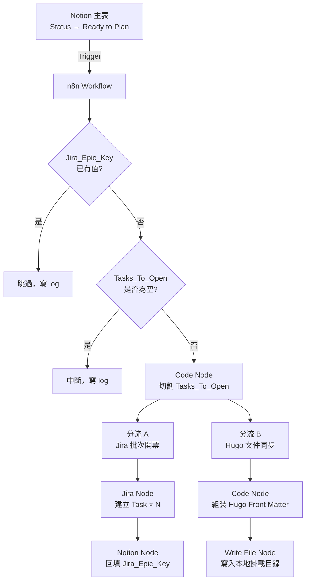

# Phase 2 — n8n 自動化分流管線：設計文件

> 閱讀對象：SA、Backend、DevOps
> 產出工具：/addyosmani-saspec
> 前置條件：Phase 1 全部完成

---

## 技術架構



---

## n8n 節點清單

| 順序 | 節點名稱 | 型態 | 說明 |
|------|---------|------|------|
| 1 | Notion Trigger | Notion Trigger | Poll 模式，每分鐘檢查一次 |
| 2 | 冪等檢查 | IF | `Jira_Epic_Key` 為空才繼續 |
| 3 | 空任務檢查 | IF | `Tasks_To_Open` 不為空才繼續 |
| 4 | 切割任務 | Code（JS） | 依換行符切割，產出任務陣列 |
| 5A | 建立 Jira Task | Jira Software（迴圈） | 每個任務建一張票 |
| 6A | 回填 Epic Key | Notion | 更新主表 `Jira_Epic_Key` |
| 5B | 組裝 Front Matter | Code（JS） | 產出 Hugo Markdown 內容 |
| 6B | 寫入文件 | Write Binary File | 寫到本地掛載路徑 |

---

## Tasks_To_Open 格式規範

每行格式：`[類型] 任務標題｜TDD: 測試命名`

```
[Backend] 實作 POST /api/shorten｜TDD: 應該_成功產生短網址_當輸入合法URL時
[Backend] 實作 GET /:code 轉址｜TDD: 應該_成功轉址_當短碼存在時
[DevOps] 建立 DynamoDB Table schema｜TDD: 應該_成功寫入並讀取資料_當Schema正確時
```

切割邏輯（Code Node JS）：
```javascript
const raw = $input.item.json.properties.Tasks_To_Open.rich_text
  .map(t => t.plain_text).join('');

const lines = raw.split('\n').map(l => l.trim()).filter(l => l.length > 0);

return lines.map(line => {
  const [left, right] = line.split('｜TDD:');
  const roleMatch = left.match(/^\[(.+?)\]/);
  return {
    json: {
      role: roleMatch ? roleMatch[1] : 'Backend',
      title: left.replace(/^\[.+?\]\s*/, '').trim(),
      tdd: right ? right.trim() : '',
      notionPageId: $input.item.json.id,
      notionPageUrl: $input.item.json.url,
      specUrl: $input.item.json.properties.Spec_URL?.url ?? '',
      slug: $input.item.json.properties.Slug?.rich_text[0]?.plain_text ?? '',
    }
  };
});
```

---

## Jira 票面自動組裝格式

```
## 任務說明
{{title}}

## TDD 完成定義 (DoD)
- [ ] 測試命名：`{{tdd}}`
- [ ] 🔴 紅燈：測試必須先 Fail，截圖或終端機輸出為憑
- [ ] 🟢 綠燈：實作後測試 Pass，覆蓋率 100%
- [ ] 🔵 藍燈：重構完成，git commit 已執行

## 規格來源
- Notion：{{notionPageUrl}}
- Spec：{{specUrl}}
```

Jira 節點設定：
- **Host**：`https://prostyliu.atlassian.net`
- **Project**：`ASUS`
- **Issue Type**：`Task`
- **執行模式**：`Run Once for Each Item`

---

## Hugo Front Matter 組裝格式

Code Node 產出（JS）：
```javascript
const props = $input.item.json.properties;
const title = props.Name.title[0]?.plain_text ?? '';
const slug = props.Slug?.rich_text[0]?.plain_text ?? '';
const weight = props.Weight?.number ?? 99;
const body = $input.item.json.properties.Tasks_To_Open
  ?.rich_text.map(t => t.plain_text).join('') ?? '';

const content = `---
title: "${title}"
weight: ${weight}
---

${body}
`;

return [{ json: { slug, content } }];
```

Write File 節點寫入路徑：
```
/data/projects/awtw-short-url-service/hugo-docs/content/docs/{{$json.slug}}.md
```

---

## n8n Credential 設定清單

| Credential | 型態 | 需要的值 |
|-----------|------|---------|
| Notion API | Notion API | Internal Integration Token |
| Jira API | Jira API | Email + API Token（從 Atlassian 帳號設定取得） |

取得 Jira API Token：
1. 開啟 `https://id.atlassian.com/manage-profile/security/api-tokens`
2. 點「Create API token」
3. 複製 Token，填入 n8n Jira Credential

---

## 技術決策

| 決策項目 | 選擇 | 理由 | 備選方案 |
|---------|------|------|---------|
| Notion Trigger 模式 | Poll（每分鐘） | n8n Free 版不支援 Notion Webhook | Webhook（需付費方案） |
| Jira 連線方式 | n8n 內建 Jira Software node | 官方支援，不需自行處理 OAuth | HTTP Request 自組（過度複雜） |
| 冪等判斷欄位 | `Jira_Epic_Key` 是否有值 | 簡單可靠，開票後即回填 | 另建狀態欄位（過度設計） |
| 任務切割語言 | n8n Code Node（JavaScript） | n8n 原生支援，無需安裝依賴 | Python（n8n 不原生支援） |
| Hugo 文件寫入 | Write Binary File 節點 | 直接寫本地掛載目錄 | Git commit（過度複雜） |

---

## 已知風險與對策

| 風險 | 機率 | 對策 |
|------|------|------|
| Notion Poll 最快每分鐘觸發一次，有延遲 | 高（設計限制） | 接受，非即時需求可容忍 |
| Tasks_To_Open 格式錯誤導致切割失敗 | 中 | Code Node 加防禦性解析，格式錯誤的行跳過並 log |
| Jira API Rate Limit（免費版每 10 秒 50 次） | 低 | 每張票建立間隔無需刻意控制，批次量少 |
| Write File 路徑不存在導致寫入失敗 | 低 | 確認 hugo-docs/content/docs/ 目錄已存在（Phase 1 已建） |
| n8n 容器重啟後 Workflow 遺失 | 低 | Workflow JSON 版控於 Git，可隨時匯入還原 |
