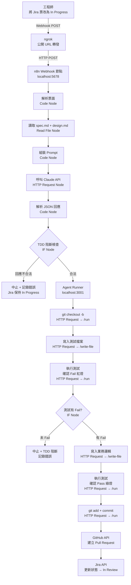

# Phase 3 — Jira Webhook → Claude API 全自動開發代理人：設計文件

> 閱讀對象：SA、Backend、DevOps
> 產出工具：/addyosmani-saspec
> 前置條件：Phase 1、Phase 2 全部完成

---

## 技術架構



---

## n8n 節點清單

| 順序 | 節點名稱 | 型態 | 說明 |
|------|---------|------|------|
| 1 | Jira Webhook | Webhook | 接收 Jira Cloud 的 Webhook POST |
| 2 | 解析票面 | Code（JS） | 從 Webhook payload 取出票號、標題、TDD DoD |
| 3 | 讀取 spec.md | Read Binary File | 從本地掛載路徑讀取 spec.md |
| 4 | 讀取 design.md | Read Binary File | 從本地掛載路徑讀取 design.md |
| 5 | 組裝 Prompt | Code（JS） | 組合 System Prompt + User Prompt |
| 6 | 呼叫 Claude API | HTTP Request | POST 到 Anthropic API |
| 7 | 解析回應 | Code（JS） | 解析 Claude 回傳的 JSON 結構 |
| 8 | TDD 阻斷 IF | IF | 確認回應包含必要欄位 |
| 9 | git checkout | HTTP Request → Agent Runner `/run` | 建立 feature branch |
| 10 | 寫入測試檔案 | HTTP Request → Agent Runner `/write-file` | 寫入 Claude 產出的測試程式碼 |
| 11 | 執行測試（紅燈） | HTTP Request → Agent Runner `/run` | `npm run test`，預期 Fail |
| 12 | 紅燈確認 IF | IF | 確認 exitCode != 0 |
| 13 | 寫入業務邏輯 | HTTP Request → Agent Runner `/write-file` | 寫入 Claude 產出的實作程式碼 |
| 14 | 執行測試（綠燈） | HTTP Request → Agent Runner `/run` | `npm run test`，預期 Pass |
| 15 | git commit | HTTP Request → Agent Runner `/run` | `git add` + `git commit` + `git push` |
| 16 | 建立 GitHub PR | HTTP Request | GitHub API 建立 Pull Request |
| 17 | 更新 Jira 狀態 | HTTP Request / Jira Node | 票狀態改為 `In Review` |

---

## Jira Webhook 設定

Jira Cloud 只能 POST 到公開 URL，本地開發需要透過 **ngrok** 將 n8n 暴露至網際網路：

```
Jira Cloud → https://<ngrok-id>.ngrok.io/webhook/jira-inprogress → n8n localhost:5678
```

ngrok 啟動指令：
```bash
ngrok http 5678
```

Jira Webhook 設定路徑：
`Jira 專案設定 → Project Settings → Webhooks → Create webhook`

觸發條件：
- Event：`Issue updated`
- JQL Filter：`project = ASUS AND status = "In Progress"`

---

## Claude API Prompt 設計

### System Prompt（固定）
```
你是一位嚴格遵循 TDD 紀律的 TypeScript 後端工程師。
你必須依照以下規範產出程式碼：
- 函式長度上限 30 行
- 所有錯誤處理必須有繁體中文上下文，禁止 silent fail
- 測試命名格式：應該_<預期行為>_當<條件>
- 禁止直接產出業務邏輯，必須先產出測試檔案

你的輸出必須是嚴格的 JSON 格式：
{
  "test_file_path": "test/xxx.test.ts",
  "test_file_content": "（完整測試檔案內容）",
  "impl_file_path": "src/xxx.ts",
  "impl_file_content": "（完整業務邏輯內容）",
  "commit_message": "feat(backend): [票號] 實作功能描述"
}
```

### User Prompt（動態組裝）
```
Jira 票號：{{jira_key}}
任務標題：{{jira_summary}}
TDD 完成定義：{{tdd_dod}}

規格文件內容：
{{spec_md_content}}

設計文件內容：
{{design_md_content}}

請依照上述規格，產出這張票的測試檔案與業務邏輯實作。
```

### Claude API 呼叫設定

```json
{
  "model": "claude-sonnet-4-6",
  "max_tokens": 4096,
  "messages": [
    { "role": "user", "content": "{{assembled_prompt}}" }
  ],
  "system": "{{system_prompt}}"
}
```

HTTP Request 節點設定：
- **URL**：`https://api.anthropic.com/v1/messages`
- **Method**：POST
- **Headers**：
  - `x-api-key`：`{{ $credentials.anthropicApiKey }}`
  - `anthropic-version`：`2023-06-01`
  - `content-type`：`application/json`

---

## TypeScript 專案結構

```
awtw-short-url-service/
├── src/
│   ├── shorten.ts          # 短網址產生邏輯
│   └── redirect.ts         # 轉址邏輯
├── test/
│   ├── shorten.test.ts     # 由 Claude 產出
│   └── redirect.test.ts    # 由 Claude 產出
├── package.json
├── tsconfig.json
└── vitest.config.ts
```

`package.json` scripts：
```json
{
  "scripts": {
    "test": "vitest run",
    "test:watch": "vitest"
  }
}
```

---

## Agent Runner 服務

> n8n Docker 映像（硬化版與 Docker Hub 版）均無套件管理器，無法安裝 git。
> 改用 Agent Runner 架構：在 Windows 本機跑 Node.js HTTP 服務，n8n 透過 `http://host.docker.internal:3001` 呼叫。

**檔案位置**：`awtw-short-url-service/agent-runner/server.js`

**啟動指令**：
```powershell
cd "D:\06_Workspace\Workspace_GitHub\xu3clayu83ire\alag-addyosmani-demos\awtw-short-url-service\agent-runner"
node server.js
```

**API 端點**：

| 端點 | 用途 | Request Body | Response |
|------|------|-------------|---------|
| `POST /run` | 執行 shell 指令 | `{ command, cwd? }` | `{ stdout, stderr, exitCode }` |
| `POST /write-file` | 寫入檔案 | `{ filePath, content }` | `{ success, filePath }` |

**n8n 呼叫範例（HTTP Request 節點）**：
```
URL: http://host.docker.internal:3001/run
Method: POST
Body: { "command": "git --version", "cwd": "D:\\path\\to\\project" }
```

**環境需求（Windows 本機）**：

| 工具 | 用途 | 是否已有 |
|------|------|---------|
| Node.js 20+ | 執行 Agent Runner | ✅ 本機已有 |
| git | 版控操作 | ✅ 本機已有 |
| npm / vitest | 執行 TypeScript 測試 | ✅ 本機已有 |

---

## GitHub PR 建立

使用 GitHub REST API：

```
POST https://api.github.com/repos/{owner}/{repo}/pulls
```

Request Body：
```json
{
  "title": "[ASUS-N] 任務標題",
  "head": "feature/ASUS-N",
  "base": "main",
  "body": "## 自動產生的 Pull Request\n\n- Jira：{{jira_url}}\n- 由 ADW 自動建立"
}
```

---

## Jira 票面解析邏輯

Webhook payload 結構：
```json
{
  "issue": {
    "key": "ASUS-1",
    "fields": {
      "summary": "實作 POST /api/shorten",
      "description": {
        "content": [...]
      },
      "status": { "name": "In Progress" }
    }
  }
}
```

TDD DoD 從 Description 中解析 `測試命名：` 欄位後的文字。

---

## 技術決策

| 決策項目 | 選擇 | 理由 | 備選方案 |
|---------|------|------|---------|
| Jira Webhook 公開 URL | ngrok（本地開發） | 最快速的本地暴露方案 | 部署 n8n 至公開伺服器（Phase 5） |
| 測試框架 | Vitest | 現代 TypeScript 原生支援，速度快 | Jest（較成熟但需額外配置） |
| Claude API 呼叫方式 | HTTP Request 節點 | n8n 無內建 Anthropic node，HTTP 最直接 | 自訂 n8n node（過度複雜） |
| git 操作位置 | Agent Runner（Windows Host） | n8n 映像無套件管理器無法安裝 git；本機已有 git 與 GitHub 認證 | n8n 容器內（需自訂 Dockerfile，Docker 硬化版不支援） |
| TDD 驗證方式 | Execute Command exit code 判斷 | 簡單可靠，測試失敗 exit code ≠ 0 | 解析測試輸出文字（易出錯） |

---

## 已知風險與對策

| 風險 | 機率 | 對策 |
|------|------|------|
| ngrok 免費版 URL 每次重啟改變 | 高 | 每次啟動後更新 Jira Webhook URL；或付費固定 subdomain |
| Claude API 回傳非 JSON | 中 | 解析節點加防禦性 try/catch，失敗時中止並通知 |
| 測試紅燈未 Fail（Claude 寫了不嚴格的測試） | 中 | TDD 阻斷機制強制中止，Jira 票保持 In Progress |
| n8n 容器無 git 指令 | 已確認（Docker 硬化版移除套件管理器） | 改用 Agent Runner HTTP 服務在 Windows 本機執行 git，Phase 3 DevOps T01 已完成 |
| GitHub Token 權限不足 | 低 | Token 需含 `repo` 範圍，Credential 設定時確認 |
| spec.md 路徑不存在 | 低 | Read File 節點加錯誤處理，路徑依 Notion Slug 動態組裝 |
