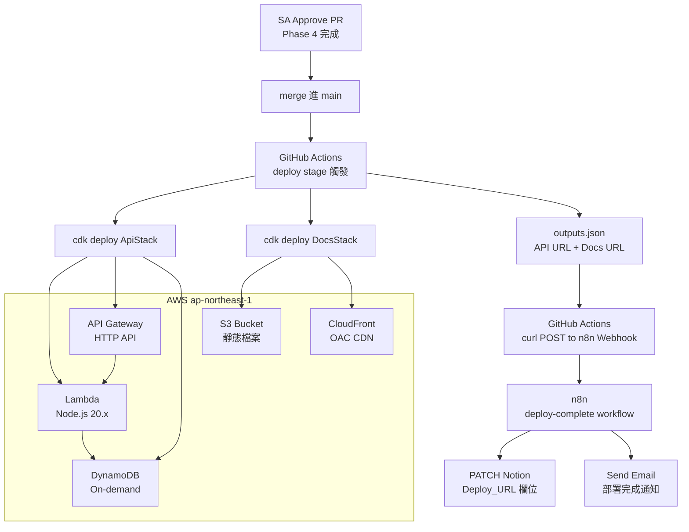

# Phase 5 — AWS CDK 自動部署：設計文件

> 閱讀對象：SA、Backend、DevOps
> 前置條件：phase5-aws-deploy/spec.md 已確認

---

## 技術架構



---

## 模組拆解

| 模組 | 職責 | 負責角色 |
|------|------|---------|
| `cdk/lib/api-stack.ts` | 定義 Lambda + API Gateway + DynamoDB CDK Stack | DevOps |
| `cdk/lib/docs-stack.ts` | 定義 S3 + CloudFront CDK Stack | DevOps |
| `cdk/bin/app.ts` | CDK App 入口，實例化兩個 Stack | DevOps |
| `cdk/lambda/handler.ts` | Lambda 函式：實作 POST /api/shorten 與 GET /{code} | Backend |
| `.github/workflows/deploy.yml` | GitHub Actions deploy stage（僅 main branch） | DevOps |
| n8n `deploy-complete` workflow | 接收部署完成通知，回填 Notion + 發 Email | Backend |

---

## 資料模型

### DynamoDB Table

```typescript
// Table Name: ShortUrlTable
// Partition Key: code (String)
// Billing Mode: PAY_PER_REQUEST (On-demand)

interface ShortUrlRecord {
  code: string;        // 6 碼短碼，Partition Key
  originalUrl: string; // 原始完整 URL
  createdAt: string;   // ISO 8601 timestamp
}
```

### Lambda 環境變數

```typescript
interface LambdaEnv {
  TABLE_NAME: string;  // DynamoDB Table 名稱，由 CDK 注入
}
```

### CDK Outputs

```typescript
// cdk deploy --outputs-file outputs.json 產出
interface CdkOutputs {
  ApiStack: {
    ApiUrl: string;    // API Gateway HTTP API URL
  };
  DocsStack: {
    DocsUrl: string;   // CloudFront Distribution URL
  };
}
```

---

## API 契約

### POST /api/shorten

```
Request:
  POST /api/shorten
  Content-Type: application/json
  Body: { "url": "https://example.com/very/long/path" }

Response 200:
  { "shortUrl": "https://<api-gateway-domain>/abc123" }

Response 400（URL 格式錯誤）:
  { "error": "無效的 URL 格式，必須以 http:// 或 https:// 開頭" }

Response 500:
  { "error": "伺服器錯誤，請稍後再試" }
```

### GET /{code}

```
Request:
  GET /abc123

Response 301:
  Location: https://example.com/very/long/path

Response 404:
  { "error": "短網址不存在" }
```

---

## Lambda 實作設計

```typescript
// cdk/lambda/handler.ts

import { DynamoDBClient } from '@aws-sdk/client-dynamodb';
import { DynamoDBDocumentClient, GetCommand, PutCommand } from '@aws-sdk/lib-dynamodb';

const client = DynamoDBDocumentClient.from(new DynamoDBClient({}));
const TABLE_NAME = process.env.TABLE_NAME!;

// 短碼字元集（排除 O, 0, I, l 易混淆字元）
const CHARSET = 'ABCDEFGHJKLMNPQRSTUVWXYZabcdefghjkmnpqrstuvwxyz23456789';

export const handler = async (event: APIGatewayProxyEventV2) => {
  const method = event.requestContext.http.method;
  const path = event.requestContext.http.path;

  if (method === 'POST' && path === '/api/shorten') {
    return handleShorten(event);
  }
  if (method === 'GET' && path !== '/api/shorten') {
    return handleRedirect(event);
  }
  return { statusCode: 404, body: JSON.stringify({ error: '找不到路由' }) };
};
```

---

## GitHub Actions deploy.yml 設計

```yaml
name: Deploy

on:
  push:
    branches: [main]

jobs:
  deploy:
    runs-on: ubuntu-latest
    needs: []   # ci.yml 的 test + lint 已在 PR 階段驗證
    steps:
      - uses: actions/checkout@v4
      - uses: actions/setup-node@v4
        with:
          node-version: '20'
          cache: 'npm'
      - run: npm ci
      - run: npm ci
        working-directory: cdk
      - name: Deploy CDK
        env:
          AWS_ACCESS_KEY_ID: ${{ secrets.AWS_ACCESS_KEY_ID }}
          AWS_SECRET_ACCESS_KEY: ${{ secrets.AWS_SECRET_ACCESS_KEY }}
          AWS_DEFAULT_REGION: ap-northeast-1
        run: |
          cd cdk
          npx cdk deploy --all --require-approval never \
            --outputs-file outputs.json
      - name: 通知 n8n 部署完成
        run: |
          API_URL=$(cat cdk/outputs.json | jq -r '.ApiStack.ApiUrl')
          DOCS_URL=$(cat cdk/outputs.json | jq -r '.DocsStack.DocsUrl')
          curl -X POST "${{ secrets.N8N_WEBHOOK_URL }}" \
            -H "Content-Type: application/json" \
            -d "{\"apiUrl\":\"$API_URL\",\"docsUrl\":\"$DOCS_URL\"}"
```

---

## n8n deploy-complete Workflow 設計

### 節點流程

```
Webhook（POST /webhook/deploy-complete）
  → Code node「解析部署資訊」
  → HTTP Request「更新 Notion Deploy_URL」
  → Send Email「部署完成通知」
```

### 更新 Notion Deploy_URL

```
PATCH https://api.notion.com/v1/pages/{NOTION_PAGE_ID}
Authorization: Bearer {NOTION_TOKEN}
Notion-Version: 2022-06-28
Body: {
  "properties": {
    "Deploy_URL": { "url": "{apiUrl}" }
  }
}
```

### Email 通知格式

```
主旨：[ASUS 部署完成] Phase 5 AWS CDK 部署成功

內容：
部署完成通知

短網址 API：https://<api-gateway-domain>
Hugo 文件站：https://<cloudfront-domain>

部署時間：2026-xx-xx xx:xx
```

---

## GitHub Actions Secrets 清單

| Secret 名稱 | 說明 | 取得方式 |
|------------|------|---------|
| `AWS_ACCESS_KEY_ID` | IAM User Access Key | AWS Console → IAM → Users |
| `AWS_SECRET_ACCESS_KEY` | IAM User Secret Key | 同上（建立時一次性顯示） |
| `N8N_WEBHOOK_URL` | n8n Webhook URL | ngrok URL + `/webhook/deploy-complete` |
| `NOTION_TOKEN`（選用） | 若 n8n 不可用時直接呼叫 | Notion → Settings → Integrations |

---

## 技術決策

### 決策 1：兩個獨立 CDK Stack vs 單一 Stack

- **選擇**：兩個獨立 Stack（ApiStack + DocsStack）
- **理由**：文件站更新（Hugo 內容）不應觸發後端 Lambda 重部署；職責分離降低風險
- **取捨**：deploy 時間略長（需 deploy 兩個 Stack）

### 決策 2：API Gateway HTTP API vs REST API

- **選擇**：HTTP API
- **理由**：PoC 只需基本路由，HTTP API 成本比 REST API 低約 70%，延遲更低
- **取捨**：缺少 API Key / Usage Plan 等進階功能（PoC 不需要）

### 決策 3：部署後通知走 n8n vs 直接呼叫 Notion API

- **選擇**：GitHub Actions curl → n8n → Notion（保留 n8n 作為中介）
- **理由**：n8n 同時處理 Notion 回填與 Email 通知，統一在一個 workflow 管理；`N8N_WEBHOOK_URL` Secret 更新頻率低（ngrok 不常重啟）
- **取捨**：依賴本機 ngrok 穩定性；ngrok 重啟需手動更新 Secret

### 決策 4：Lambda handler 單檔 vs 多檔分離

- **選擇**：單檔 `handler.ts`（含 shorten + redirect 兩個功能）
- **理由**：PoC 規模小，兩個 endpoint 邏輯簡單，不需要過早拆分
- **取捨**：未來功能增加時需重構為多檔

---

## 已知風險與對策

| 風險 | 對策 |
|------|------|
| `cdk bootstrap` 未執行導致部署失敗 | DevOps T01 明確要求先執行 `cdk bootstrap ap-northeast-1` |
| IAM 權限不足（CDK 需要 CloudFormation / Lambda / DynamoDB / S3 / CloudFront 權限） | 使用 `AdministratorAccess` 管理用 IAM User（PoC 階段；正式環境需最小權限原則） |
| ngrok 重啟導致 N8N_WEBHOOK_URL 失效 | 部署失敗時 curl 回傳非 200，CI log 顯示警告但不阻擋部署成功 |
| DynamoDB 短碼碰撞 | 6 碼 58 字元 = 3.8 億組合，PoC 規模碰撞機率極低；正式環境需加碰撞偵測重試邏輯 |
