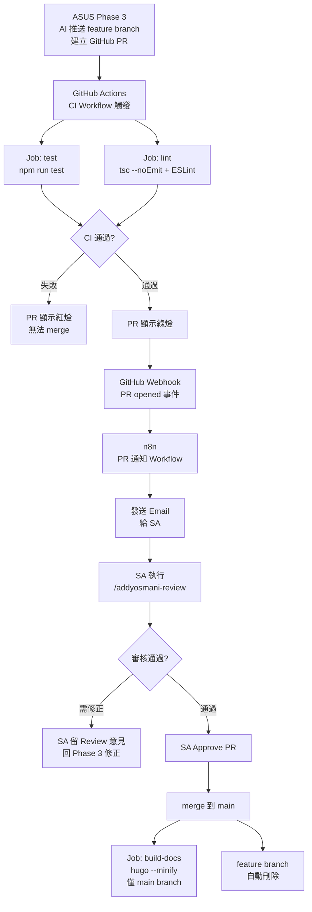

# Phase 4 — GitHub Actions CI/CD 自動化測試與 PR 審核流程：設計文件

> 閱讀對象：SA、Backend、DevOps
> 前置條件：phase4-cicd-review/spec.md 已確認

---

## 技術架構



---

## 模組拆解

| 模組 | 職責 | 負責角色 |
|------|------|---------|
| `.github/workflows/ci.yml` | 定義 CI pipeline：test / lint / build-docs 三個 job | DevOps |
| GitHub Branch Protection | 保護 main branch，強制 PR + CI 通過 + Approve | DevOps |
| n8n PR 通知 Workflow | 接收 GitHub PR Webhook，解析 PR 資訊，發送 Email | Backend |
| Email 通知模板 | 格式化審核通知內容（票號、PR 連結、CI 狀態） | Backend |

---

## CI Workflow 設計

### `.github/workflows/ci.yml`

```yaml
name: CI

on:
  push:
    branches: ['**']
  pull_request:
    branches: [main]

jobs:
  test:
    runs-on: ubuntu-latest
    steps:
      - uses: actions/checkout@v4
      - uses: actions/setup-node@v4
        with:
          node-version: '20'
          cache: 'npm'
      - run: npm ci
      - run: npm run test

  lint:
    runs-on: ubuntu-latest
    steps:
      - uses: actions/checkout@v4
      - uses: actions/setup-node@v4
        with:
          node-version: '20'
          cache: 'npm'
      - run: npm ci
      - run: npx tsc --noEmit

  build-docs:
    runs-on: ubuntu-latest
    needs: [test, lint]
    if: github.ref == 'refs/heads/main'
    steps:
      - uses: actions/checkout@v4
      - name: Setup Hugo
        uses: peaceiris/actions-hugo@v3
        with:
          hugo-version: 'latest'
      - run: hugo --minify --source hugo-docs
      - uses: actions/upload-artifact@v4
        with:
          name: hugo-public
          path: hugo-docs/public/
          retention-days: 7
```

---

## n8n PR 通知 Workflow 設計

### 觸發條件
- GitHub Webhook：事件類型 `pull_request`，action = `opened`
- Webhook URL：ngrok 轉發至 n8n

### 節點流程

```
GitHub PR Webhook
  → 解析 PR 資訊（Code node）
  → 發送 Email（Send Email node）
```

### 解析 PR 資訊（Code node）

```javascript
const payload = $input.first().json.body ?? $input.first().json;
const pr = payload.pull_request ?? {};

// 從 PR title 萃取 Jira 票號（格式：[ASUS-N] 功能描述）
const titleMatch = pr.title?.match(/\[([A-Z]+-\d+)\]/);
const jiraKey = titleMatch ? titleMatch[1] : '（無票號）';

return [{
  json: {
    jiraKey,
    prTitle: pr.title ?? '',
    prUrl: pr.html_url ?? '',
    prNumber: pr.number ?? '',
    branch: pr.head?.ref ?? '',
    author: pr.user?.login ?? '',
  }
}];
```

### Email 通知格式

```
主旨：[ASUS 審核通知] [ASUS-N] 功能描述

內容：
新 PR 待審核

票號：ASUS-N
功能：實作 POST /api/shorten
分支：feature/ASUS-N → main
PR 連結：https://github.com/xu3clayu83ire/awtw-short-url-service/pull/N

請執行 /addyosmani-review 後至 GitHub 頁面 Approve。
```

---

## GitHub Branch Protection 設定

main branch 保護規則：

| 規則 | 設定值 |
|------|-------|
| Require a pull request before merging | ✅ 啟用 |
| Required approvals | 1 |
| Require status checks to pass | ✅ test、lint |
| Require branches to be up to date | ✅ 啟用 |
| Allow deletions | ❌ 關閉 |
| Automatically delete head branches | ✅ 啟用（PR merge 後自動刪除） |

---

## 資料模型

```typescript
// n8n PR Webhook payload（解析後）
interface PrNotificationPayload {
  jiraKey: string;       // 從 PR title 萃取，如 "ASUS-42"
  prTitle: string;       // PR 完整標題
  prUrl: string;         // GitHub PR 頁面連結
  prNumber: number;      // PR 編號
  branch: string;        // feature branch 名稱
  author: string;        // GitHub 帳號（AI 推送者）
}
```

---

## 技術決策

### 決策 1：GitHub Actions vs 自架 CI Runner

- **選擇**：GitHub Actions（GitHub hosted runner）
- **理由**：PoC 階段零維運成本，免費額度足夠（public repo 無限制，private repo 2000 min/月）
- **取捨**：無法自訂 runner 環境，但 Node.js 20 官方 image 已足夠

### 決策 2：Email 通知 vs Webhook 直接觸發

- **選擇**：n8n 發送 Email
- **理由**：SA 可在任意裝置收到通知；Email 有完整記錄可追溯
- **取捨**：需要 n8n SMTP 設定，延遲可能比 Webhook 推播略高（通常 < 1 分鐘）

### 決策 3：ESLint 設定範圍

- **選擇**：僅 `tsc --noEmit`（TypeScript 型別檢查），暫不加 ESLint rules
- **理由**：PoC 階段避免 lint rules 過嚴導致 AI 產出的程式碼頻繁失敗
- **取捨**：程式碼風格一致性依賴 Claude 自身慣例，非強制規範

---

## 已知風險與對策

| 風險 | 對策 |
|------|------|
| ngrok URL 重啟後改變，GitHub Webhook 失效 | 每次重啟後更新 GitHub repo 的 Webhook URL；Phase 5 改用固定 domain |
| Email 被標記為垃圾郵件 | 使用 Gmail SMTP + App Password；主旨加入 `[ASUS 審核通知]` 前綴方便過濾 |
| CI 執行時間超過 3 分鐘 | npm ci 加 cache 策略（key: package-lock.json hash）；test / lint 平行執行 |
| PR title 沒有 Jira 票號格式 | Code node 解析失敗時仍發送 Email，票號欄位顯示「（無票號）」，不中斷流程 |
